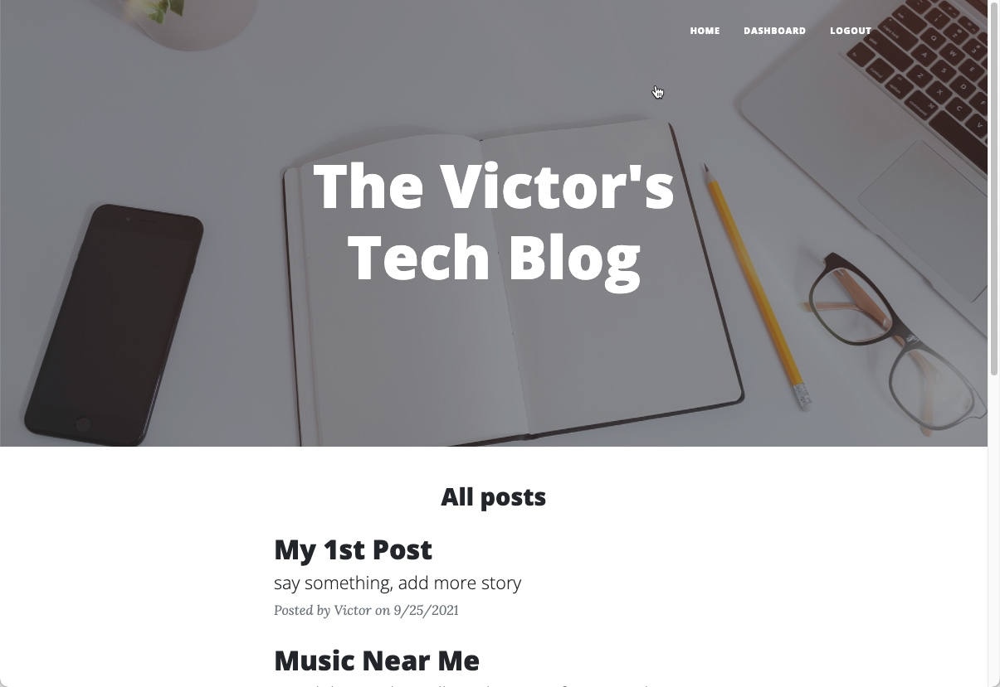

# tech-blog
## Description
A simple tech blog using Model View Controller (MVC) paradigm. Built using MySQL2, Express, Sequelize, Bulma, Handlebars, Bootstrap and dotenv.

Repository: 
    https://github.com/mingmanhk/tech-blog
     
Demo

## Table of Contents
1. [Installation](#installation)

2. [Usage](#usage)

3. [Credits](#credits)

4. [License](#license)

5. [Features](#features)

6. [Contribute](#contribute)

7. [Test](#test)

8. [Questions](#questions)

## Installation
    1. Run npm install to install all dependencies
    2. Run npm run seed to add sample data

## Usage
   1. Open terminal
   2. Run 'npm start'
   3. Open http://localhost:3001/ from browser
   
   
   
## Credits
Victor Lam

## License

## Features
This application provided following functionality:

    * View All post
    * Create login account
    * Login to create/edit/delete post
    * Add comment with or without login
    * Login out 
    
Additional feature:

    * Anonymous user can post comment without user account

## Contribute
Victor Lam

## Questions
Questions about this repository? Please contact me at [mingmanhk@gmail.com](mailto:mingmanhk@gmail.com).
View more of my work in GitHub at [mingmanhk](https://github.com/mingmanhk)